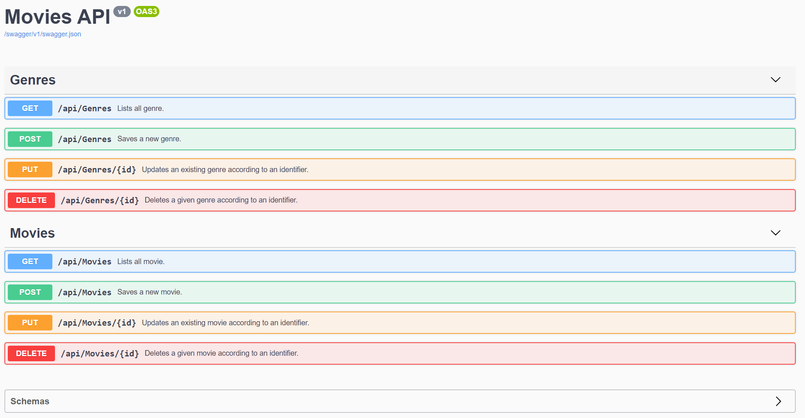
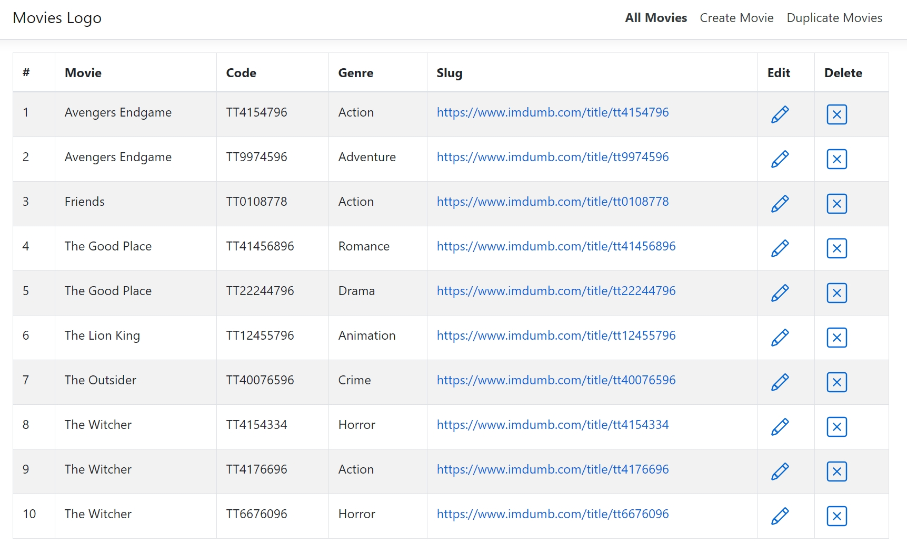

# Movies API and UI

### Frameworks and Libraries

* ASP.NET Core 3.0
* Entity Framework Core (for data access)
* Entity Framework In-Memory Provider (for testing purposes)
* Entity Framework Sql Server Provider (for production)
* Dependency Injection Core
* AutoMapper (for mapping resources and models)
* Swashbuckle (API documentation)
* Angular 8
* Bootstrap 4
* TypeScript
* ngx Toast (for error notifications)
* Lodash

## IDE and Tools

* Visual Studio Code 1.42.0
* Visual Studio 2019 Community 16.3.9
* SQL Server Management Studio 18.4

## Build and Run

1. Git clone the project
2. Checkout master and pull latest
3. Build using Visual Studio 2019
3. Run UI and API with **Crtl + F5
4. UI opens in browser with https://localhost:44348
5. API opens in browser with https://localhost:44348/swagger

## Swagger API

## Angular UI

