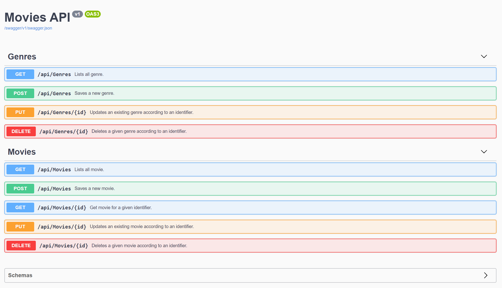

# Movies API and UI

### Frameworks and Libraries

* ASP.NET Core 3.0
* Entity Framework Core (for data access)
* Entity Framework In-Memory Provider (for testing purposes)
* Entity Framework Sql Server Provider (for production)
* Dependency Injection Core
* AutoMapper (for mapping resources and models)
* Swashbuckle (API documentation)
* Angular 8
* Bootstrap 4
* TypeScript
* ngx Toast (for error notifications)
* Lodash

* Lodash
* Lodash

## 

## Build

## Running unit tests

## Swagger API

## Angular UI

